# 🧭 TraversalCoreProject

### Full-Stack Reservation System | Layered Architecture | Enterprise-Level Design

---

## 📌 About the Project

  
A full-featured **Reservation System Web Application** built with ASP.NET Core. This project is one of the most strategic milestones in my backend development journey. 
Developed by following a 100-lesson intensive course by [Murat Yücedağ](https://www.youtube.com/playlist?list=PLKnjBHu2xXNMK5MBogdXmsXVi3K_eEZT5) , not just by watching but by actively coding, debugging, and improving the project step by step.

This project aims to simulate a **real-world tour agency system** with advanced backend structures, clean architecture principles, layered design, and API integrations.

My goal was not just to "complete" a project — I wanted to **deeply understand** professional software development concepts. I focused on architectural decisions, data flow, user management, validation logic, and dashboard features throughout the process.

---

## 🛠️ Screenshots

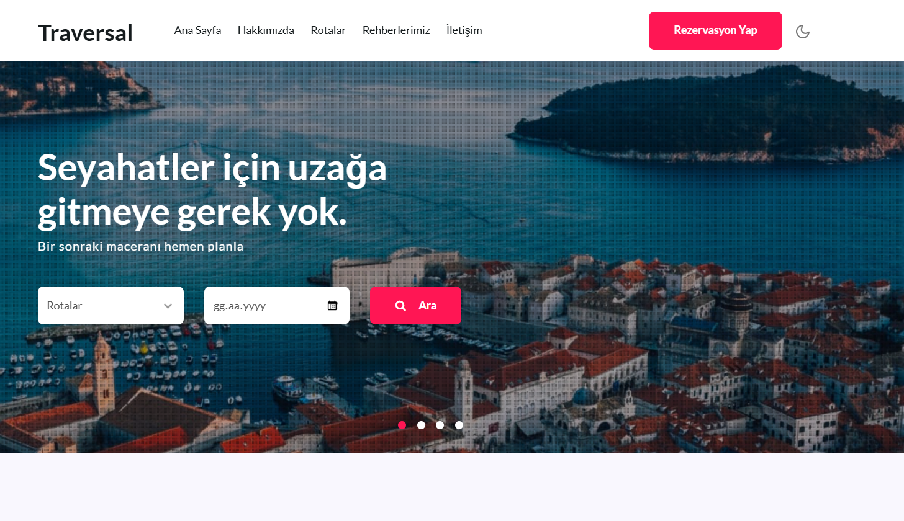
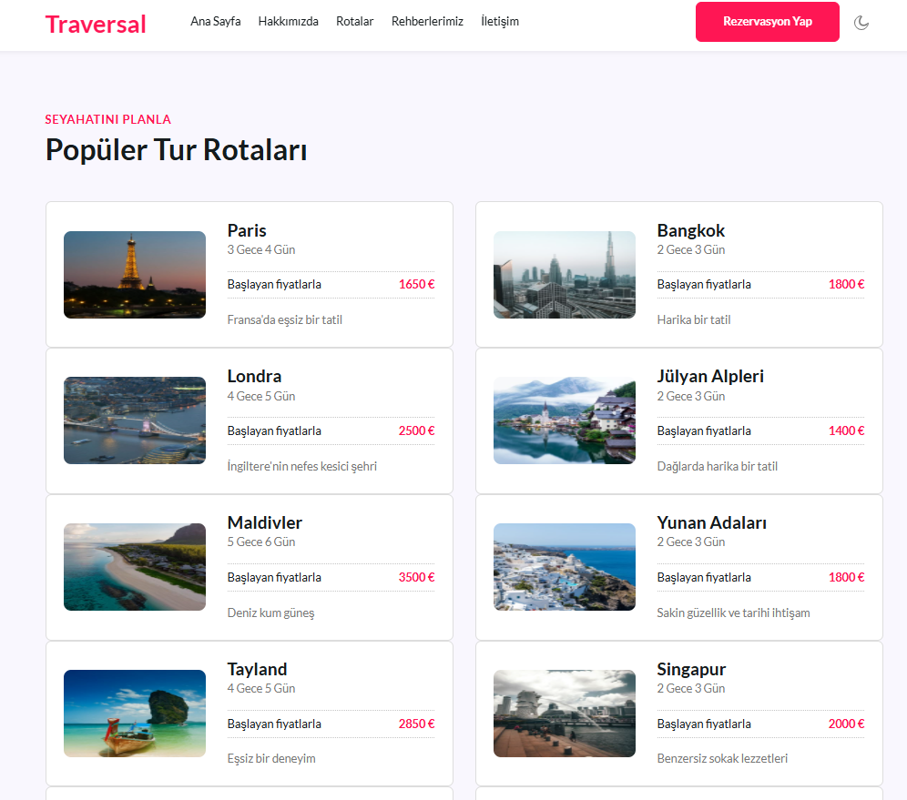
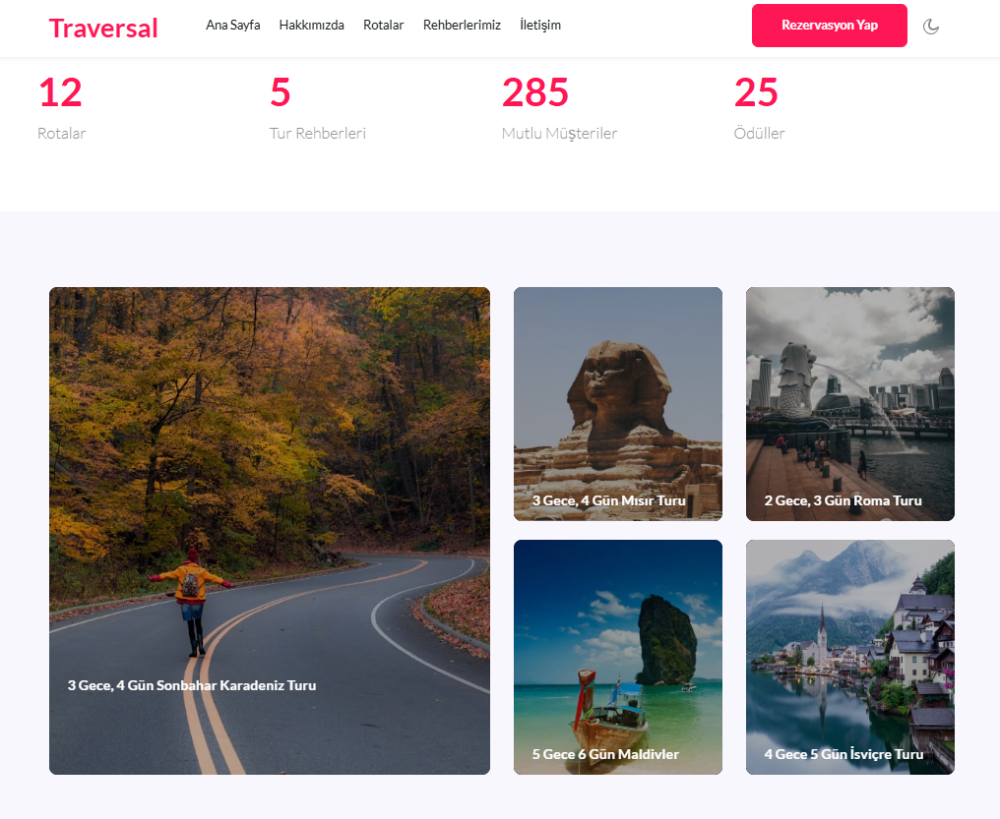
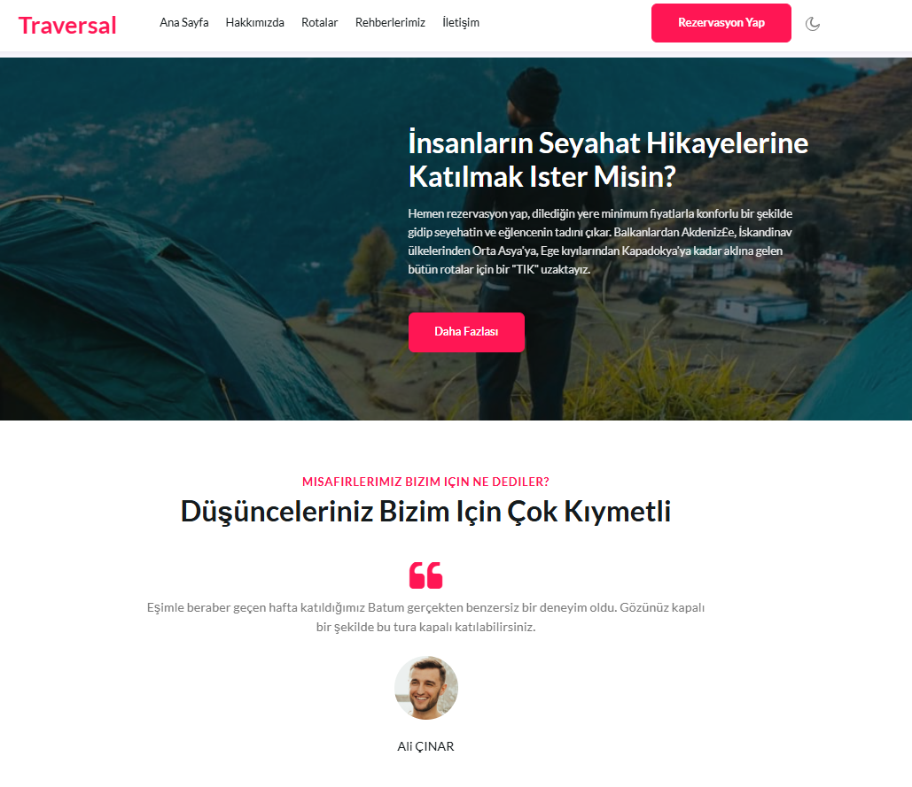
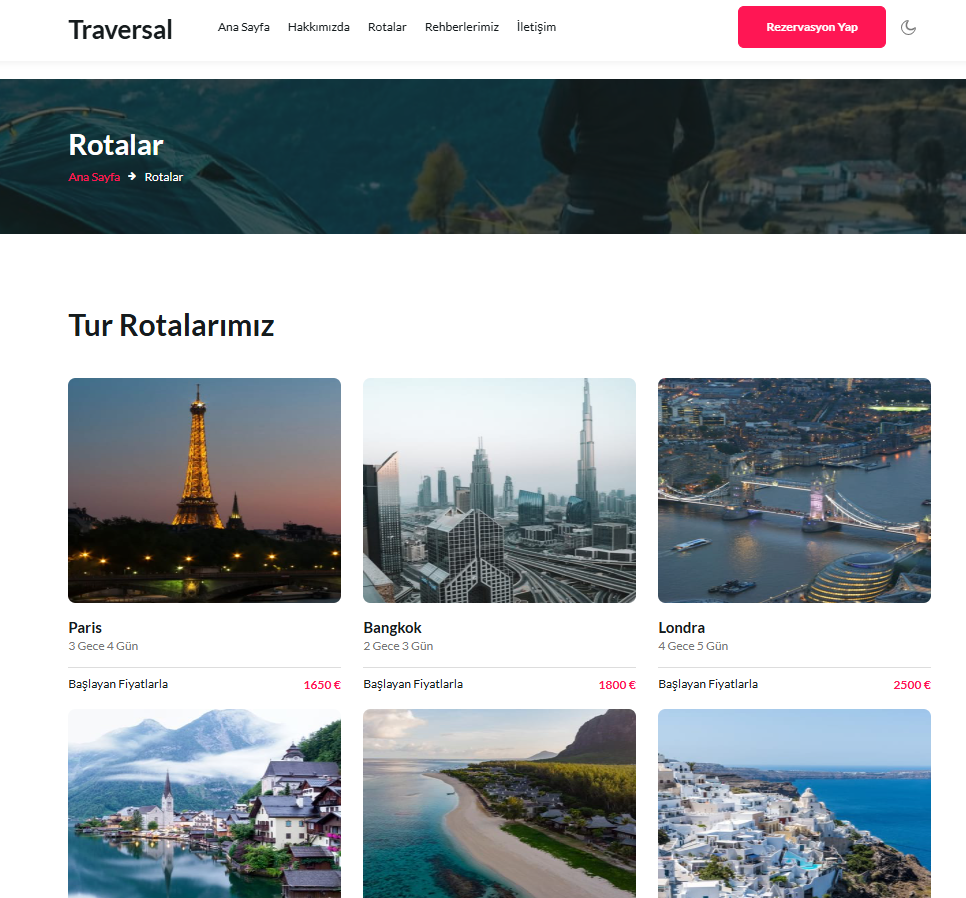
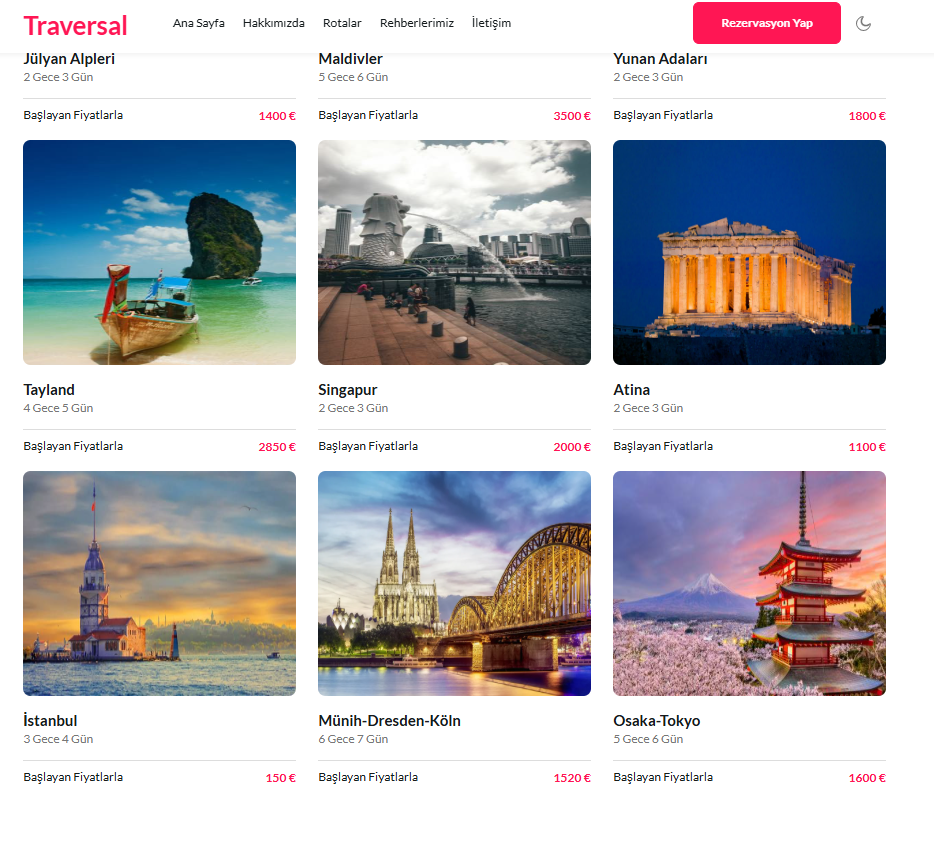
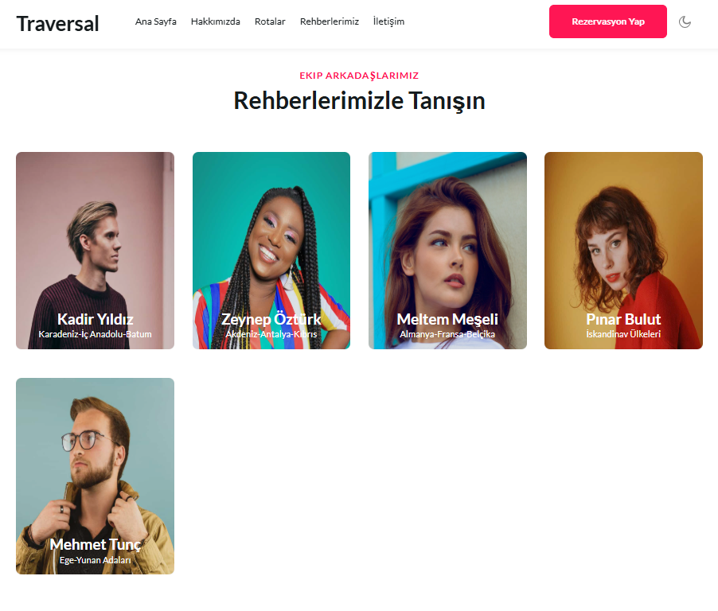
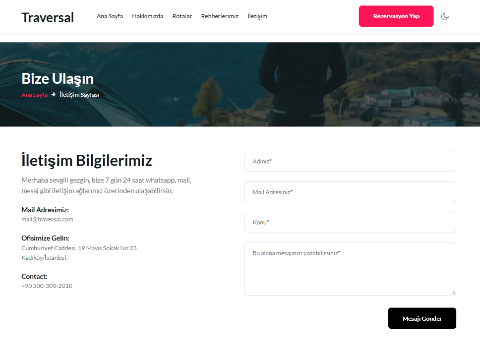
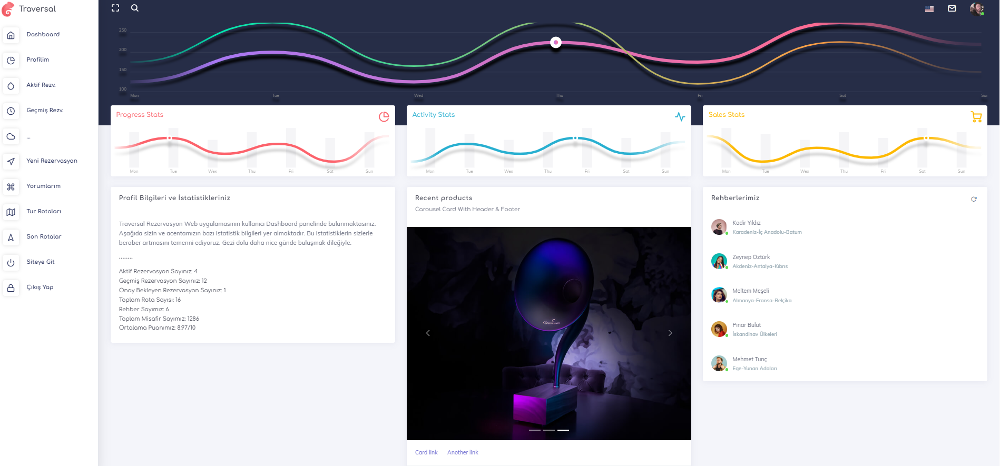
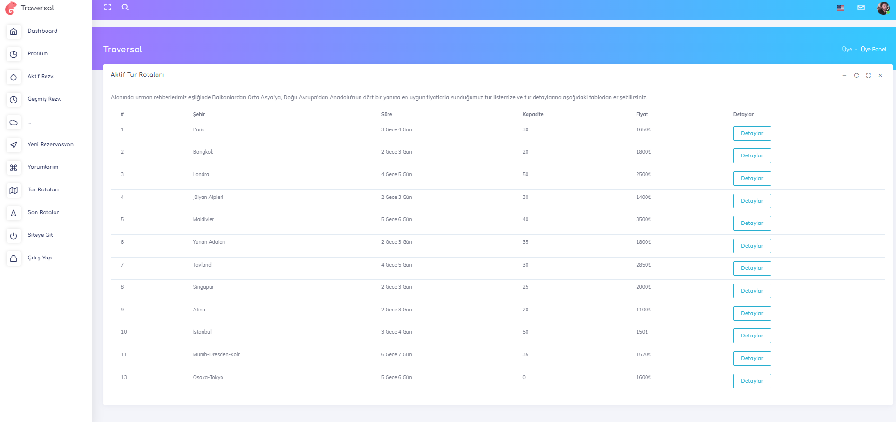
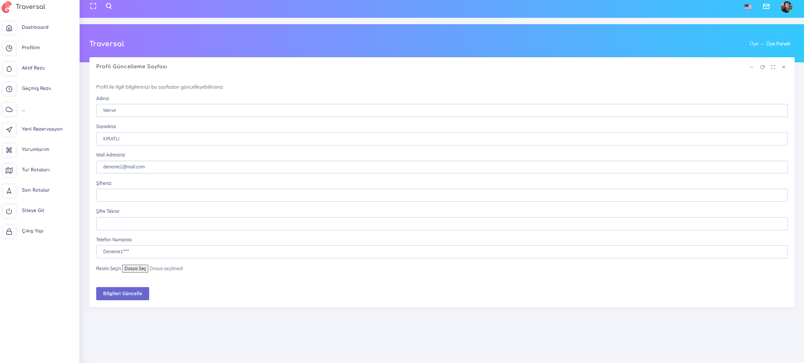
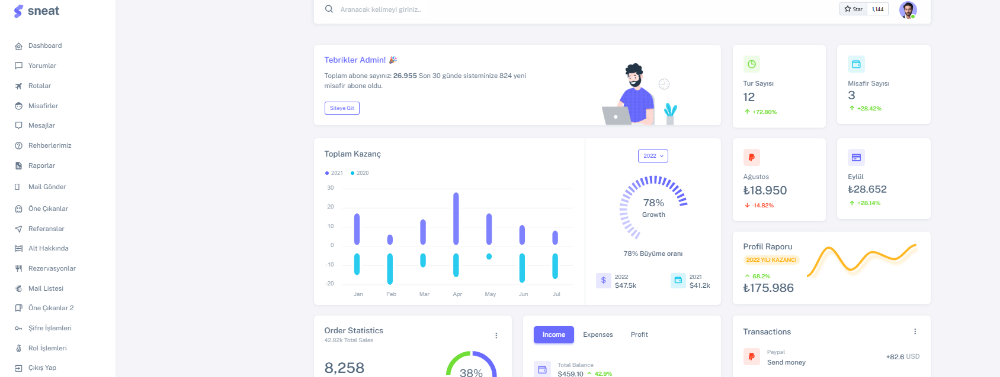
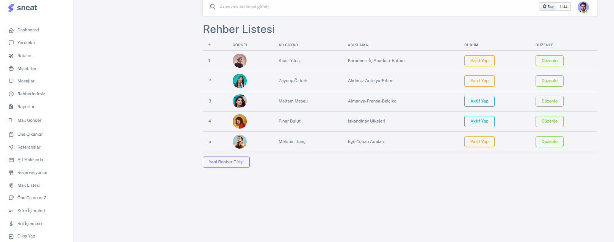
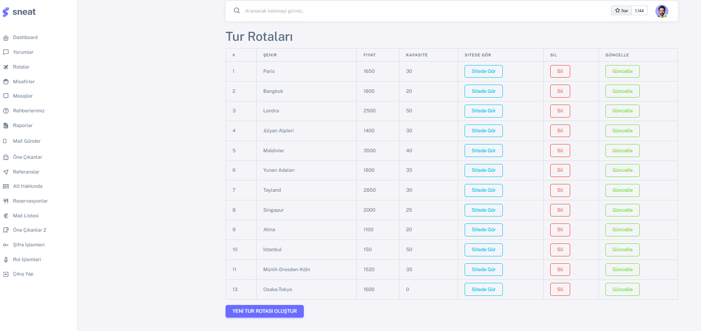
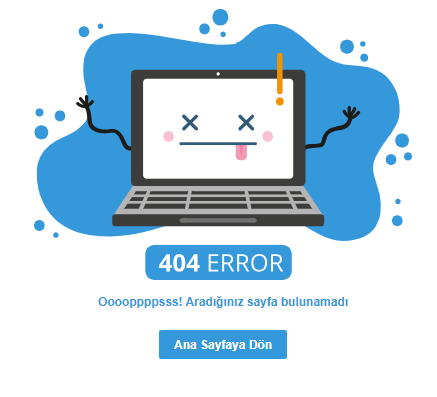

---

## 🚀 What This Project Taught Me

- Applying **Clean Architecture** in a real project
- Designing **multi-layered enterprise applications**
- Working with **Entity Framework Core** using Code First + Migrations
- Implementing **user authentication & role-based authorization**
- Building and consuming **real-time SignalR services**
- Developing and consuming **custom APIs**
- Enforcing **data validation** with FluentValidation
- Understanding **CQRS** patterns and separating concerns

---

## 🛠️ Technologies Used

- C#, ASP.NET Core MVC  
- Entity Framework Core – Code First & Migrations  
- SQL Server – Database Management System  
- ASP.NET Identity – Authentication & Authorization  
- FluentValidation – Advanced Form Controls  
- ViewComponent & Partial View – Modular UI Components  
- Role-Based Authorization – Admin/Member Separation  
- AutoMapper, DTO Architecture, SOLID Principles
-  `SignalR` – Real-time data streaming
- `RapidAPI` & custom API consumption
- Clean Architecture Approach
- `CQRS` (Command–Query Responsibility Segregation)
- 🐘 PostgreSQL – Although the final version uses MSSQL, PostgreSQL was initially set up and partially integrated in the early stages of the training. I gained valuable experience configuring PostgreSQL connections, migrations, and schema setup during this process.

---

## 📂 Project Architecture

### **TraversalCoreProject/**
| Folder                  | Description                                                 |
|-------------------------|-------------------------------------------------------------|
| **BusinessLayer**       | → Services and Business Rules                               |
| **DataAccessLayer**     | → EF Core, DbContext, Generic Repository                    |
| **DTOs**                | → Data Transfer Objects (API<->UI)                          |
| **EntityLayer**         | → Domain Models (e.g., Destination, Reservation, AppUser)   |
| **SignalRApi**          | → Real-time data provider (SignalR Hub)                     |
| **SignalRApiForSql**    | → SQL-based real-time data broadcasting                     |
| **SignalRConsume**      | → Client-side SignalR consumption module                    |
| **TraversalCoreProject**| → Presentation Layer (Controllers, Views, Areas)            |
├── Areas                 | # Admin and Member modules (Role-based)                     |
├── Controllers           | # MVC + API Controllers                                     |
├── CQRS                  | # Command & Query separation logic                          |
├── Mapping               | # AutoMapper configurations                                 |
├── LogFile               | # Custom logging utilities                                  |
├── Models / Resources    | # Entity models, localization etc.                          |
├── ViewComponents        | # Reusable UI components                                    |
├── Views / wwwroot       | # Razor views and static content                            |
└── Program.cs / Startup  | # App configuration                                         |

---

## 🔄 Integration with TraversalApiProject

This project is directly integrated with a custom API project developed as a separate microservice layer:
- **GitHub Repo**: [TraversalApiProject](https://github.com/mrvekratl/TraversalApiProject)

### 🔹 Why This Matters

By structuring this integration, I was able to gain hands-on experience with:

- 🔧 **Designing API Architectures** with multiple REST endpoints
- 🔌 **Consuming both internal and external APIs** (e.g., RapidAPI for weather/news data)
- 💻 **Using HttpClient** within service layers
- 🧩 **Building modular, decoupled components** for easy maintenance and scalability
- 🔁 **Connecting frontend views** with dynamic API-driven content

---

---

## 📊 Real-Time Communication with SignalR

This project implements a simulated **real-time dashboard system** using SignalR technology.

### 📡 SignalR Components:

- `SignalRApi`: Core SignalR Hub broadcasting live visitor data
- `SignalRApiForSql`: Sends real-time updates triggered by SQL changes
- `SignalRConsume`: Consumes and renders real-time data on the client side

> 📈 **Use Cases**:
> - Live visitor analytics  
> - Instant notifications  
> - Admin panel charting and data visualization

---

## 🧠 Final Thoughts

This project represents the output of a self-driven learning journey through a **100-lesson** ASP.NET Core series.  
Throughout the process, I continuously challenged myself to:

- ✅ Refactor and improve upon tutorial code
- ✅ Apply real enterprise design patterns (CQRS, DTOs, Clean Architecture)
- ✅ Experiment with PostgreSQL, RapidAPI, and SignalR
- ✅ Break down responsibilities into separate services and modules

> I consider this project as more than just a tutorial—it's a **milestone** in my growth as a backend developer.

---

## 📎 Resources & Links

- 🎓 **Course Playlist**: [YouTube – Traversal Mini Project by Murat Yücedağ](https://www.youtube.com/playlist?list=PLKnjBHu2xXNMK5MBogdXmsXVi3K_eEZT5)  
- 🧠 **API Repository**: [TraversalApiProject](https://github.com/mrvekratl/TraversalApiProject)  
- 📧 **Contact**: [LinkedIn – Merve Kıratlı](https://www.linkedin.com/in/merve-kiratli-0b049a187)

---

## 🙏 Special Thanks

Huge thanks to **Murat Yücedağ**, whose dedication to teaching made this project possible.  
His **clear instruction**, **realistic design choices**, and **depth of knowledge** created an ideal environment for hands-on learning.

---

## ⭐️ For Recruiters

If you're searching for a backend developer who is:

- 🧠 Inquisitive and driven
- 👩‍💻 Dedicated to writing clean, scalable code
- 🌐 Skilled in API design and integration
- 🛠️ Familiar with enterprise practices and real-world scenarios

Feel free to connect.  
**Let’s build something great together!** 🚀

